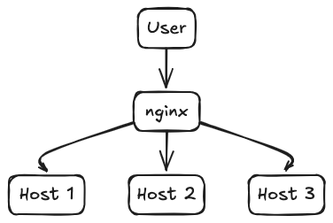

# Var Log Collection 2000
A web service to retrieve and search log files from hosts.

## Usage
To run this web application, you need the `Flask` Python web framework installed:

```
pip install Flask==3.0.3
```

Run the web application:
```
flask --app log_collection.app run --host=0.0.0.0 --port=5100
```


Search for logs after internally exposing the service, e.g.:

http://127.0.0.1:5100/var/log/syslog/syslog.log


## Development
### Running
Run server with a custom path to logs for testing:
```
LC_VAR_LOG_DIR="`pwd`/tests/logs" flask --app log_collection.app run --port=5100 --debug
```

Note: We use port 5100 as the default 5000 often clashes with a MacOS service.

### Testing
Unite tests are found under the folder `tests/`. To run unit-tests:
```
python -m unittest
```

You also use `tests/logs/log_collection/log_collection.log` to [view logs from this application](http://127.0.0.1:5100/var/log/log_collection/log_collection.log) for [dogfooding](https://en.wikipedia.org/wiki/Eating_your_own_dog_food).

You can also gunzip `tests/logs/syslog/syslog.log.gz` logs for testing, note that it's not tracked in due to its large size.

### Dependencies
To make code contributions, we recomming using the following packages to provide a consistent development experience:

* `black` for standardizing and auto-formatting any code changes you make in your IDE of choice,
* `coverage` for unit-test coverage reports,
* `mypy` for static type checking based on type-annotations.

```
python -m venv .venv && source .venv/bin/activate
pip install -r requirements.txt
```

Finally, run `deactivate` to exit the virtual environment when done using `deactivate`.


## Architecture
An internal user accesses web applications running on hosts, nginx can sit in between to facilitate routing, potentially add caching etc.




## Out of scope
* Full stack set up, such as the http proxy/load balancer (e.g. nginx), uwsgi (e.g. uvicorn), Kubernetes manifests or VMs Terraform definition
* Caching layer based on usage patterns, or for sharing search results
* Authentication layer
* Removal of sensitive contents (Credit card numbers, emails, PII, HIPAA, GDPR...)
* Folder contents, the user must specify log files by name

## Further improvements
* Forward logs to a central system, with machines as parameters. A log forwarder job sends log events in batches to a message bus to be ingested by a central system, where machines are but another tag to potentially filter by.
* Read larger chunks of text at a time for better IO performance, and adjust if a newline is present