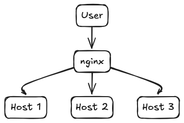

# Var Log Collection 2000
A web service to retrieve and search log files from hosts.

## Usage
To run this web application, you need the `Flask` Python web framework installed:

```
pip install Flask==3.0.3
```

Run the server:
```
flask --app log_collection.py --host=0.0.0.0
```


Search for logs after internally exposing the service, e.g.:

http://127.0.0.1:5000/var/log/syslog/syslog.log


## Development
To make code contributions, we'll use the following packages to help in development:

* 'black' for standardizing and auto-formatting any code changes you make in your IDE of choice,
* 'coverage' for unit-test coverage reports,
* 'mypy' for static type checking based on type-annotations.

```
python -m venv .venv && source .venv/bin/activate
pip install -r requirements-dev.txt
```

Run server with a custom path to logs for testing:
```
LC_VAR_LOG_DIR="`pwd`/tests/logs" flask --app log_collection.py --debug
```

### Testing
Unite tests are found under the folder `tests/`. To run unit-tests:
```
python -m unittest
```


Finally, you can exit the virtual environment when done using `deactivate`.


## Architecture
An internal user accesses web applications running on hosts, nginx can sit in between to facilitate routing, potentially add caching etc.


Typically however, a log forwarder sends log events in batches to a message bus to be ingested a central system, where machines are another tag to filter by.


## Out of scope
* Full stack set up, such as the http proxy/load balancer (e.g. nginx), uwsgi (e.g. uvicorn), Kubernetes manifests or VMs Terraform definition
* Caching layer based on usage patterns, or for sharing search results
* Authentication layer
* Content filtering based on sensitive content (CC, emails, PII)

## Further improvements
* Forward logs to a central system, with machines as parameters